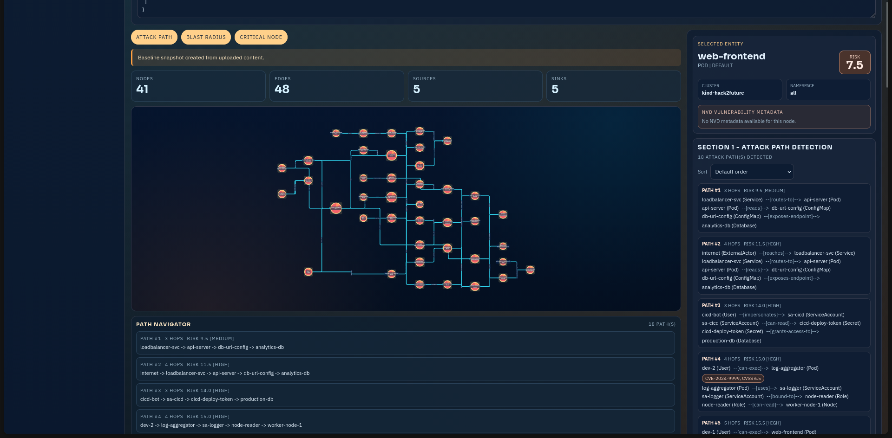

# Hack2Future

Kubernetes security analysis platform for attack-path discovery, blast-radius analysis, cycle detection, critical-node remediation, and temporal drift tracking.

## Dashboard Preview



## Start Here

- Backend docs hub: [tool/README.md](tool/README.md)
- Frontend docs hub: [frontend/README.md](frontend/README.md)
- Full functionality checklist: [FULL_FUNCTIONALITY_CHECK.md](FULL_FUNCTIONALITY_CHECK.md)
- PPT-ready project dossier: [PROJECT_PPT_DOSSIER.md](PROJECT_PPT_DOSSIER.md)

## Find By Task

- I want to set up and run the backend quickly: [tool/docs/quickstart-and-setup.md](tool/docs/quickstart-and-setup.md)
- I want CLI examples for each analysis mode: [tool/docs/cli-modes-and-examples.md](tool/docs/cli-modes-and-examples.md)
- I want API endpoint and snapshot workflow details: [tool/docs/api-and-snapshots.md](tool/docs/api-and-snapshots.md)
- I want architecture and algorithm overview: [tool/docs/architecture-and-algorithms.md](tool/docs/architecture-and-algorithms.md)
- I want graph schema details: [tool/docs/schema-reference.md](tool/docs/schema-reference.md)
- I want testing commands and rubric mapping: [tool/docs/testing-and-rubric.md](tool/docs/testing-and-rubric.md)
- I want frontend setup steps: [frontend/docs/getting-started.md](frontend/docs/getting-started.md)
- I want frontend page and feature map: [frontend/docs/pages-and-features.md](frontend/docs/pages-and-features.md)
- I want troubleshooting steps: [frontend/docs/troubleshooting.md](frontend/docs/troubleshooting.md)

## Documentation Map

### Backend (`tool/`)

- Index: [tool/docs/README.md](tool/docs/README.md)
- Setup: [tool/docs/quickstart-and-setup.md](tool/docs/quickstart-and-setup.md)
- CLI: [tool/docs/cli-modes-and-examples.md](tool/docs/cli-modes-and-examples.md)
- API + snapshots: [tool/docs/api-and-snapshots.md](tool/docs/api-and-snapshots.md)
- Architecture: [tool/docs/architecture-and-algorithms.md](tool/docs/architecture-and-algorithms.md)
- Graph schema: [tool/docs/schema-reference.md](tool/docs/schema-reference.md)
- Testing and rubric: [tool/docs/testing-and-rubric.md](tool/docs/testing-and-rubric.md)
- Fast command sheet: [tool/FASTSTART.md](tool/FASTSTART.md)

### Frontend (`frontend/`)

- Index: [frontend/docs/README.md](frontend/docs/README.md)
- Getting started: [frontend/docs/getting-started.md](frontend/docs/getting-started.md)
- Pages and features: [frontend/docs/pages-and-features.md](frontend/docs/pages-and-features.md)
- Troubleshooting: [frontend/docs/troubleshooting.md](frontend/docs/troubleshooting.md)

## Fast Local Run

Terminal 1 (backend, Linux/macOS):

```bash
cd tool
python3 -m venv .venv
source .venv/bin/activate
python -m pip install --upgrade pip
python -m pip install -e .
uvicorn api.app:app --app-dir src --host 0.0.0.0 --port 8000 --reload
```

Terminal 1 (backend, Windows PowerShell):

```powershell
cd tool
py -3 -m venv .venv
.\.venv\Scripts\Activate.ps1
python -m pip install --upgrade pip
python -m pip install -e .
uvicorn api.app:app --app-dir src --host 0.0.0.0 --port 8000 --reload
```

Terminal 2 (frontend):

```bash
cd frontend
npm install
npm run dev
```

Open:

- http://localhost:5173/graph
- http://localhost:5173/ingest
- http://localhost:5173/risks
- http://localhost:5173/snapshots

## Repository Layout

- `tool/`: Python engine, API, reporting, temporal snapshots, tests.
- `frontend/`: React dashboard for graph, ingest, risk, and snapshots.
- `tests/`: shared fixture and output artifacts.
